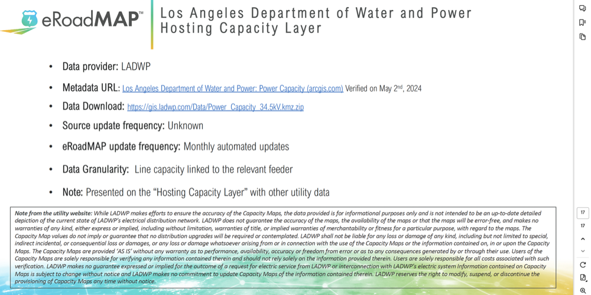

# Los Angeles Department of Water and Power: Power Capacity Layer Analysis

## Data Source

This repository utilizes data from the Los Angeles Department of Water and Power (LADWP), specifically focusing on the Power Capacity Layer. The data provides insights into the electrical distribution network's capacity at 34.5kV.



### Data Details:
- **Provider:** LADWP
- **Metadata URL:** [LADWP Power Capacity](https://arcgis.com)
- **Data Download:** [Power Capacity Data](https://gis.ladwp.com/Data/Power_Capacity_34.5kV.kmz.zip)
- **Update Frequency:** Source - Unknown, eRoadMAP - Monthly

### Note:
The data is intended for informational purposes only and does not guarantee the accuracy or the timeliness of updates. For more detailed disclaimers, refer to the LADWP's note in the dataset's documentation.

## Repository Contents

- `run_code.py`: Script to download, extract, and process the KMZ file into usable data formats.
- `requirements.txt`: List of Python packages required to run the script.
- `data/`: Directory containing extracted and processed data.

## Installation and Usage

1. **Clone the Repository:**
   ```bash
   git clone https://github.com/yourusername/repositoryname.git
   cd repositoryname
   ```

2. **Install Dependencies:**
   ```bash
   pip install -r requirements.txt
   ```

3. **Run the Script:**
   To download the `.kmz` file, extract it, parse the `.kml`, and generate the CSV file:
   ```bash
   python run_code.py
   ```

## Output

The final output of the script is a CSV file named `power_capacity_data.csv`, which contains detailed information on the power capacity across various locations in the LADWP system. Below is an explanation of each column in the CSV file:

1. **`Name`**:
   - The name of the power line or node, representing specific points in the LADWP electrical distribution network.
   
2. **`GIS ID`**:
   - A unique identifier for the geographic information system (GIS) entry, which uniquely identifies each feature in the dataset.

3. **`OH_UG`**:
   - This column indicates whether the line is overhead (`OVERHEAD CONDUCTOR`) or underground (`UNDERGROUND CONDUCTOR`).

4. **`Capacity_Range_KW`**:
   - The power capacity range for the specific node or line in kilowatts (kW). This gives an indication of how much electrical power the line can handle. The capacity is typically given as a range (e.g., `300 - 450 kW`).

5. **`Capacity_Status`**:
   - The status of the power capacity for the feature. This status indicates whether the capacity is classified as `High`, `Medium`, `Low`, or `No Capacity`. This helps to understand the current load-carrying ability of the node or line.

6. **`Voltage_Class`**:
   - This indicates the voltage classification of the power line or node (e.g., `34.5kV`, `4.8kV`). The voltage class corresponds to the rated voltage at which the line operates.

7. **`Coordinates`**:
   - The geographic coordinates (longitude, latitude) of the node or line. These are typically provided as a pair of geographic coordinates in the form `longitude,latitude`, allowing for precise location mapping of the electrical features.

## Example of CSV Output:

```
Name, GIS ID, OH_UG, Capacity_Range_KW, Capacity_Status, Voltage_Class, Coordinates
Node_A, OHP2122942, OVERHEAD CONDUCTOR, 300 - 450, Medium Capacity, 34.5-KV, -118.4924572005797,34.06244818062703
Node_B, OHP2122943, UNDERGROUND CONDUCTOR, 100 - 200, Low Capacity, 4.8-KV, -118.4929000367039,34.06252923874073
...
```

